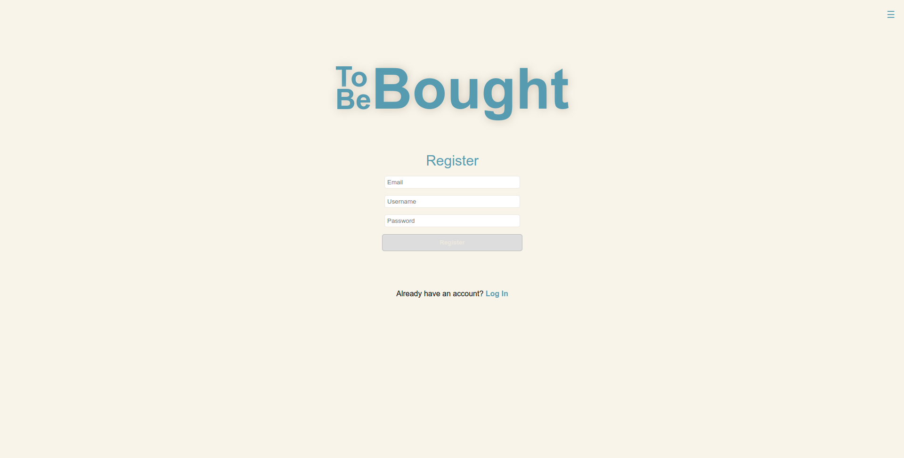
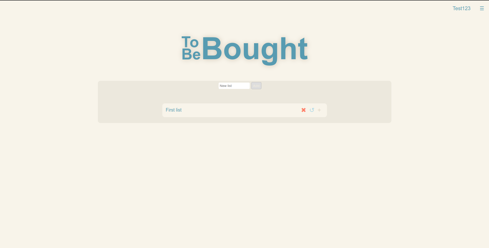
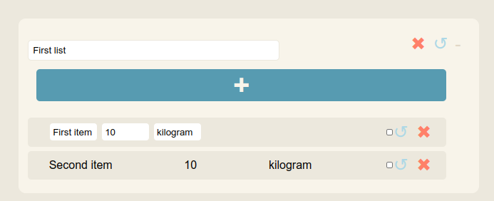
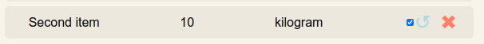

# ToBeBought-SpringBoot-ReactJS
Simple app for storing users shopping lists, allowing to register and login with JWT authentication. Application gives access to store users' lists and items "to be bought" from those lists.
User can also modify existing lists and contained items by updating their data as well as deleting them completely from database.

## How to run Backend
For backend you'll need Java 19 and Maven installed in your system

1. Go to `Backend` folder and run `docker compose up
2. In terminal access container terminal using 
```
docker exec -it postgresql bash
```
3. create database:
```
psql -U admin
CREATE DATABASE tobebought;
```
4. In `./Backend/tobebought` install maven dependencies using `mvn install`
5. In the same folder run program using mvn `clean spring-boot:run`

## How to run Frontend
Frontend requires Node and npm.

1. Go to `./Frontend/tobebought`
2. Run `npm install`
3. Run `npm start`
4. Site should be available at `localhost:3000`

## Application overview

At first shows up login screen, with option allowing user to move to registration form.



After user is logged in, and jwt token is received from backend, application allows
to view all his shopping lists. Application fetches list of items basing on users id contained 
in token.


By clicking on `+` button user is able to see all elements inside shopping list.
`x` button sends delete request to backend for list, as well as for item. `&#8634;` 
opens edit form, when clicked again, changed data is being sent do backend to update record in database.



User can also check items, that have been bought from list by clicking the checkbox.
Information if item is checked is also stored in database.



To end session, user can hover the hamburger menu from top right corner which shows dropdown with logout button,
which deletes userName from session storage, and clears cookies, where the jwt token is stored.
